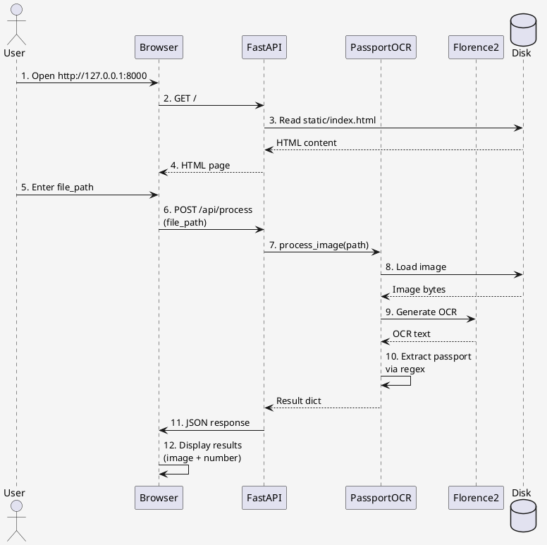

<<<<<<< HEAD
# 🏗️ System Architecture - Passport Reader API

Цей документ описує архітектуру системи Passport Reader API на рівні дизайну, компонентів та потоків даних.

## 📐 Архітектурна діаграма високого рівня

```
┌─────────────────────────────────────────────────────────────────┐
│                      End User Layer                             │
│  ┌──────────────────────────────────────────────────────────┐   │
│  │                                                          │   │
│  │         Web Browser (HTML/JS/CSS)                       │   │
│  │    - Веб-інтерфейс з полем введення файлу              │   │
│  │    - Async запити до API (Fetch API)                    │   │
│  │    - Доповнений результатами (зображення, номер)       │   │
│  │                                                          │   │
│  └──────────────────────────────────────────────────────────┘   │
│                            ▲                                     │
│                            │ HTTP (GET /)                       │
│                            │ HTTP (POST /api/process)           │
│                            ▼                                     │
└─────────────────────────────────────────────────────────────────┘
                                │
                                │
┌─────────────────────────────────────────────────────────────────┐
│                   Application Layer (API)                       │
│  ┌──────────────────────────────────────────────────────────┐   │
│  │  FastAPI Server (api.py)                               │   │
│  │  ┌─────────────────────────────────────────────────┐    │   │
│  │  │ Endpoints:                                      │    │   │
│  │  │  - GET /             → Повертає HTML           │    │   │
│  │  │  - POST /api/process → Обробка запиту          │    │   │
│  │  │  - GET /api/health   → Health check             │    │   │
│  │  │  - GET /api/info     → Info сервісу             │    │   │
│  │  │                                                 │    │   │
│  │  │ Middleware:                                     │    │   │
│  │  │  - Error Handling                               │    │   │
│  │  │  - Request Validation (Pydantic)                │    │   │
│  │  │  - CORS (if needed)                             │    │   │
│  │  │  - Logging                                      │    │   │
│  │  └─────────────────────────────────────────────────┘    │   │
│  └──────────────────────────────────────────────────────────┘   │
│                            ▲                                     │
│                            │ Method calls                        │
│                            ▼                                     │
│  ┌──────────────────────────────────────────────────────────┐   │
│  │  Inference Engine (inference.py)                        │   │
│  │  ┌──────────────────────────────────────────────────┐   │   │
│  │  │ PassportOCREngine Class:                         │   │   │
│  │  │  ┌────────────────────────────────────────────┐  │   │   │
│  │  │  │ _load_model(self):                         │  │   │   │
│  │  │  │  ├─ AutoProcessor.from_pretrained()       │  │   │   │
│  │  │  │  └─ AutoModelForCausalLM.from_pretrained()│ │   │   │
│  │  │  │     (torch.float16, SDPA attn.)          │  │   │   │
│  │  │  │                                            │  │   │   │
│  │  │  │ _load_image(self, path):                  │  │   │   │
│  │  │  │  └─ PIL.Image.open() → RGB               │  │   │   │
│  │  │  │                                            │  │   │   │
│  │  │  │ process_image(self, path):                │  │   │   │
│  │  │  │  ├─ Завантажити зображення                │  │   │   │
│  │  │  │  ├─ Препроцесинг (processor)              │  │   │   │
│  │  │  │  ├─ Інференс моделі (generate)            │  │   │   │
│  │  │  │  ├─ Декодування результатів               │  │   │   │
│  │  │  │  ├─ Вилучення номера (regex)              │  │   │   │
│  │  │  │  └─ Base64 кодування зображення           │  │   │   │
│  │  │  │                                            │  │   │   │
│  │  │  │ _extract_passport_number(self, text):    │  │   │   │
│  │  │  │  ├─ ID-картка: 9 цифр (regex)            │  │   │   │
│  │  │  │  ├─ Паспортна книж: 2 літери + 6 цифр    │  │   │   │
│  │  │  │  └─ Int'l паспорт: 9 символів             │  │   │   │
│  │  │  └────────────────────────────────────────────┘  │   │   │
│  │  └──────────────────────────────────────────────────┘   │   │
│  └──────────────────────────────────────────────────────────┘   │
│                            ▲                                     │
│                            │ Model operations                    │
│                            ▼                                     │
└─────────────────────────────────────────────────────────────────┘
                                │
                                │
┌─────────────────────────────────────────────────────────────────┐
│                     Model Layer (GPU)                           │
│  ┌──────────────────────────────────────────────────────────┐   │
│  │                                                          │   │
│  │  Florence-2-Large Model (0.77B параметрів)             │   │
│  │  ├─ Vision Encoder (ViT-like)                           │   │
│  │  │  └─ Обробляє зображення [B, 3, H, W]               │   │
│  │  │     → Embedded Tokens [B, Tokens, Embed_dim]        │   │
│  │  │                                                      │   │
│  │  ├─ Language Model Decoder (LLaMA-like)                │   │
│  │  │  └─ Обробляє текст + image embeddings              │   │
│  │  │     → Генерує OCR текст                             │   │
│  │  │                                                      │   │
│  │  └─ Attention: SDPA (FP16 für memory optimization)     │   │
│  │                                                          │   │
│  │  Device:                                                 │   │
│  │  └─ NVIDIA GPU (CUDA 12.1)                             │   │
│  │     Memory: ~2.5-3.5 GB VRAM                           │   │
│  │                                                          │   │
│  └──────────────────────────────────────────────────────────┘   │
│                                                                   │
└─────────────────────────────────────────────────────────────────┘
                                │
                                │
┌─────────────────────────────────────────────────────────────────┐
│                      Storage Layer                              │
│  ┌──────────────────────────────────────────────────────────┐   │
│  │                                                          │   │
│  │  ./models/florence2-large/                              │   │
│  │  ├─ config.json                                         │   │
│  │  ├─ model.safetensors (~18GB)                           │   │
│  │  ├─ modeling_florence2.py (patched)                     │   │
│  │  ├─ processing_florence2.py                             │   │
│  │  ├─ preprocessor_config.json                            │   │
│  │  └─ tokenizer.json                                      │   │
│  │                                                          │   │
│  │  ./logs/                                                │   │
│  │  └─ passport_api.log                                    │   │
│  │                                                          │   │
│  │  ./static/                                              │   │
│  │  └─ index.html                                          │   │
│  │                                                          │   │
│  └──────────────────────────────────────────────────────────┘   │
│                                                                   │
└─────────────────────────────────────────────────────────────────┘
```

---

## 🔄 Data Flow

### Flow 1: User Request → Infer → Response

```
1. User Input
   ├─ Відкриває http://127.0.0.1:8000/ у браузері
   └─ Вводить шлях: "D:\Images\passport.jpg"

2. Frontend (JS)
   ├─ Валідує шлях (не порожній)
   ├─ Відправляє POST запит до /api/process з JSON:
   │  {
   │    "file_path": "D:\\Images\\passport.jpg"
   │  }
   └─ Показує spinner

3. FastAPI Endpoint (api.py)
   ├─ @app.post("/api/process")
   ├─ Валідує request (Pydantic)
   ├─ Запускає ocr_engine.process_image()
   └─ Отримує результат

4. Inference Engine (inference.py)
   ├─ _load_image()
   │  └─ PIL.Image.open("D:\\Images\\passport.jpg") → RGB Image
   │
   ├─ processor()
   │  ├─ Текст: "<OCR>"
   │  ├─ Зображення: RGB Image
   │  └─ → Tensor inputs ["input_ids", "pixel_values"]
   │
   ├─ model.generate()
   │  ├─ Інференс на GPU (FP16, SDPA)
   │  ├─ Генерує токени (max_new_tokens=256)
   │  └─ → generated_ids [1, seq_len]
   │
   ├─ processor.decode()
   │  ├─ Конвертує токени на текст
   │  └─ → "<OCR>...(результат OCR)...</OCR>"
   │
   ├─ _extract_passport_number()
   │  ├─ Видаляє спец. токени
   │  ├─ Застосовує regex patterns
   │  └─ → passport_number: "123456789" або None
   │
   └─ Кодування зображення
      ├─ PIL Image → JPEG Buffer
      ├─ Buffer → Base64 string
      └─ → "data:image/jpeg;base64,/9j/4AAQ..."

5. API Response (JSON)
   {
     "status": "success",
     "passport_number": "123456789",
     "image_base64": "data:image/jpeg;base64,/9j/4AAQ...",
     "ocr_text": "(сирий текст OCR)",
     "processing_time": "0.45s",
     "error_message": null
   }

6. Frontend (JS)
   ├─ Отримує JSON відповідь
   ├─ Відображає зображення (Base64)
   ├─ Показує номер паспорта (зелений якщо знайдено)
   └─ Приховує spinner
```

---

## 📦 Component Architecture

### 1. **FastAPI Application (api.py)**

```python
app = FastAPI(
    title="Passport Reader API",
    version="0.1.0"
)

# Глобальний стан
ocr_engine: PassportOCREngine = None

# Events
@app.on_event("startup")     # Cold Start - завантаження моделі
@app.on_event("shutdown")    # Cleanup - видалення моделі з VRAM

# Endpoints
GET  /                        # HTML інтерфейс
GET  /api/health             # Ping
GET  /api/info               # Інформація
POST /api/process            # Основна функціях OCR
```

**Ролі:**

- HTTP запит/відповідь управління
- Валідація вхідних даних (Pydantic)
- Обробка помилок та статус коди
- Логування запітів

---

### 2. **Inference Engine (inference.py)**

```python
class PassportOCREngine:
    def __init__(self, model_path: str):
        self.model_path = Path(model_path)
        self.device = "cuda" if torch.cuda.is_available() else "cpu"
        self.processor = None
        self.model = None
        self._load_model()
    
    def process_image(self, image_path: str) -> Dict:
        # Основна функція обробки
        return {
            "passport_number": "123456789",
            "ocr_text": "...",
            "image": PIL.Image,
            "confidence": 0.85,
            "processing_time": 0.45
        }
```

**Ролі:**

- Керування моделлю (завантаження, інференс, очищення)
- Обробка зображень
- Вилучення номера паспорта (regex)

---

### 3. **Configuration (config.py)**

```python
# Централізована конфігурація всіх параметрів

# Модель
MODEL_NAME = "microsoft/Florence-2-large"
MODEL_CONFIG = {
    "torch_dtype": "float16",
    "attn_implementation": "sdpa",
    ...
}

# API
API_HOST = "127.0.0.1"
API_PORT = 8000

# Паспорти
PASSPORT_REGEX_PATTERNS = {
    "ukrainian_id_card": r"...",
    "passport_book": r"...",
    ...
}
```

---

### 4. **Frontend (static/index.html)**

```html
<!-- Pure HTML/CSS/JS (без фреймворків) -->

<!-- Структура: -->
<input type="text" id="filePath">                  <!-- Введення шляху -->
<button onclick="processImage()">Опрацювати</button> <!-- Кнопка -->
<div id="resultsSection">                          <!-- Результати -->
                             <!-- Зображення -->
  <div id="passportNumber">Номер паспорта</div>    <!-- Результат -->
</div>

<!-- JavaScript: -->
<script>
    async function processImage() {
        const response = await fetch('/api/process', {
            method: 'POST',
            body: JSON.stringify({ file_path: ... })
        });
        const data = await response.json();
        displayResults(data);
    }
</script>
```

---

## 🔐 Security Architecture

### 1. Input Validation

```python
# Pydantic моделі валідації
class ProcessRequest(BaseModel):
    file_path: str  # Валідація типу, довжини

# Перевірка файлу
if not Path(file_path).exists():
    raise FileNotFoundError()
```

### 2. Error Handling

```python
try:
    result = ocr_engine.process_image(file_path)
except FileNotFoundError:
    raise HTTPException(status_code=404)
except torch.cuda.OutOfMemoryError:
    raise HTTPException(status_code=500, detail="GPU OOM")
```

### 3. Resource Management

```python
# Cold Start (один раз при запуску)
@app.on_event("startup")
async def startup():
    global ocr_engine
    ocr_engine = PassportOCREngine(...)  # ~3-5 сек

# Cleanup при вимиканні
@app.on_event("shutdown")
async def shutdown():
    ocr_engine.cleanup()
    torch.cuda.empty_cache()
```

---

## 🎯 Performance Characteristics

### Latency

| Stage | Time | Notes |
|-------|------|-------|
| Cold Start | 3-5s | Завантажування моделі на GPU |
| Warm Inference | 0.3-0.8s | Сам infer Florence-2 |
| Preprocessing | 0.05s | PIL Image.open + processor |
| Postprocessing | 0.1s | Regex extraction + Base64 |
| **Total** | **~0.5-1.0s** | Per image (warm) |

### Memory

| Component | Memory | Notes |
|-----------|--------|-------|
| Model weights | 2.0-2.5 GB | FP16 quantization |
| Activation memory | 0.5 GB | During inference |
| Cache + OS | 0.5 GB | PyTorch cache, OS |
| **Total Peak** | **~3.5 GB** | VRAM requirements |

### Throughput

- **Single GPU**: ~1 image/sec (sequential)
- **Batch processing**: 4-5 images/sec (with queue)
- **Concurrent requests**: Limited by VRAM (1 at a time for 4GB GPU)

---

## 🛠️ Module Dependencies

```
api.py
├── inference.py
│   ├── torch (PyTorch - GPU computation)
│   ├── transformers (HuggingFace - Model loading)
│   └── PIL (Image processing)
│
├── config.py
│   └── pathlib (Path handling)
│
├── models/florence2-large/
│   ├── model.safetensors (Model weights)
│   ├── modeling_florence2.py
│   └── processing_florence2.py
│
└── static/
    └── index.html
```

---

## 🔄 State Management

### Global State

```python
# api.py - Глобальна змінна
ocr_engine: Optional[PassportOCREngine] = None

# Lifecycle:
# 1. Startup → __init__() → завантажити модель
# 2. Requests → process_image() → інференс
# 3. Shutdown → cleanup() → очистити VRAM
```

### No Session State

```python
# Сервис STATELESS для запитів
# Кожен запит незалежний
# Немає користувачів або сесій
```

---

## 🚀 Scaling Strategies

### Vertical Scaling (один GPU)

- Збільшити VRAM (RTX 4090 із 24GB)
- Оптимізувати інференс (batch processing)

### Horizontal Scaling (кілька GPUs)

- Multi-GPU inference (torch.nn.DataParallel)
- Load balancer (Nginx/HAProxy)
- Message queue (Redis/RabbitMQ)

### Model Optimization

- Quantization (INT8, INT4)
- Pruning
- Knowledge distillation

---

## 📊 System Diagram (PlantUML)



---

## 🎯 Design Patterns Used

### 1. **Singleton Pattern**

- `ocr_engine` - один екземпляр для всього сервера

### 2. **Factory Pattern**

- `PassportOCREngine.__init__()` - створює модель

### 3. **Strategy Pattern**

- Regex patterns для різних типів паспортів

### 4. **Dependency Injection**

- Конфіг через `config.py`
- Передача параметрів до функцій

---

**Версія документації:** 1.0  
**Останнє оновлення:** 2026/02/10
=======
# 🏗️ System Architecture - Passport Reader API

Цей документ описує архітектуру системи Passport Reader API на рівні дизайну, компонентів та потоків даних.

## 📐 Архітектурна діаграма високого рівня

```
┌─────────────────────────────────────────────────────────────────┐
│                      End User Layer                             │
│  ┌──────────────────────────────────────────────────────────┐   │
│  │                                                          │   │
│  │         Web Browser (HTML/JS/CSS)                       │   │
│  │    - Веб-інтерфейс з полем введення файлу              │   │
│  │    - Async запити до API (Fetch API)                    │   │
│  │    - Доповнений результатами (зображення, номер)       │   │
│  │                                                          │   │
│  └──────────────────────────────────────────────────────────┘   │
│                            ▲                                     │
│                            │ HTTP (GET /)                       │
│                            │ HTTP (POST /api/process)           │
│                            ▼                                     │
└─────────────────────────────────────────────────────────────────┘
                                │
                                │
┌─────────────────────────────────────────────────────────────────┐
│                   Application Layer (API)                       │
│  ┌──────────────────────────────────────────────────────────┐   │
│  │  FastAPI Server (api.py)                               │   │
│  │  ┌─────────────────────────────────────────────────┐    │   │
│  │  │ Endpoints:                                      │    │   │
│  │  │  - GET /             → Повертає HTML           │    │   │
│  │  │  - POST /api/process → Обробка запиту          │    │   │
│  │  │  - GET /api/health   → Health check             │    │   │
│  │  │  - GET /api/info     → Info сервісу             │    │   │
│  │  │                                                 │    │   │
│  │  │ Middleware:                                     │    │   │
│  │  │  - Error Handling                               │    │   │
│  │  │  - Request Validation (Pydantic)                │    │   │
│  │  │  - CORS (if needed)                             │    │   │
│  │  │  - Logging                                      │    │   │
│  │  └─────────────────────────────────────────────────┘    │   │
│  └──────────────────────────────────────────────────────────┘   │
│                            ▲                                     │
│                            │ Method calls                        │
│                            ▼                                     │
│  ┌──────────────────────────────────────────────────────────┐   │
│  │  Inference Engine (inference.py)                        │   │
│  │  ┌──────────────────────────────────────────────────┐   │   │
│  │  │ PassportOCREngine Class:                         │   │   │
│  │  │  ┌────────────────────────────────────────────┐  │   │   │
│  │  │  │ _load_model(self):                         │  │   │   │
│  │  │  │  ├─ AutoProcessor.from_pretrained()       │  │   │   │
│  │  │  │  └─ AutoModelForCausalLM.from_pretrained()│ │   │   │
│  │  │  │     (torch.float16, SDPA attn.)          │  │   │   │
│  │  │  │                                            │  │   │   │
│  │  │  │ _load_image(self, path):                  │  │   │   │
│  │  │  │  └─ PIL.Image.open() → RGB               │  │   │   │
│  │  │  │                                            │  │   │   │
│  │  │  │ process_image(self, path):                │  │   │   │
│  │  │  │  ├─ Завантажити зображення                │  │   │   │
│  │  │  │  ├─ Препроцесинг (processor)              │  │   │   │
│  │  │  │  ├─ Інференс моделі (generate)            │  │   │   │
│  │  │  │  ├─ Декодування результатів               │  │   │   │
│  │  │  │  ├─ Вилучення номера (regex)              │  │   │   │
│  │  │  │  └─ Base64 кодування зображення           │  │   │   │
│  │  │  │                                            │  │   │   │
│  │  │  │ _extract_passport_number(self, text):    │  │   │   │
│  │  │  │  ├─ ID-картка: 9 цифр (regex)            │  │   │   │
│  │  │  │  ├─ Паспортна книж: 2 літери + 6 цифр    │  │   │   │
│  │  │  │  └─ Int'l паспорт: 9 символів             │  │   │   │
│  │  │  └────────────────────────────────────────────┘  │   │   │
│  │  └──────────────────────────────────────────────────┘   │   │
│  └──────────────────────────────────────────────────────────┘   │
│                            ▲                                     │
│                            │ Model operations                    │
│                            ▼                                     │
└─────────────────────────────────────────────────────────────────┘
                                │
                                │
┌─────────────────────────────────────────────────────────────────┐
│                     Model Layer (GPU)                           │
│  ┌──────────────────────────────────────────────────────────┐   │
│  │                                                          │   │
│  │  Florence-2-Large Model (0.77B параметрів)             │   │
│  │  ├─ Vision Encoder (ViT-like)                           │   │
│  │  │  └─ Обробляє зображення [B, 3, H, W]               │   │
│  │  │     → Embedded Tokens [B, Tokens, Embed_dim]        │   │
│  │  │                                                      │   │
│  │  ├─ Language Model Decoder (LLaMA-like)                │   │
│  │  │  └─ Обробляє текст + image embeddings              │   │
│  │  │     → Генерує OCR текст                             │   │
│  │  │                                                      │   │
│  │  └─ Attention: SDPA (FP16 für memory optimization)     │   │
│  │                                                          │   │
│  │  Device:                                                 │   │
│  │  └─ NVIDIA GPU (CUDA 12.1)                             │   │
│  │     Memory: ~2.5-3.5 GB VRAM                           │   │
│  │                                                          │   │
│  └──────────────────────────────────────────────────────────┘   │
│                                                                   │
└─────────────────────────────────────────────────────────────────┘
                                │
                                │
┌─────────────────────────────────────────────────────────────────┐
│                      Storage Layer                              │
│  ┌──────────────────────────────────────────────────────────┐   │
│  │                                                          │   │
│  │  ./models/florence2-large/                              │   │
│  │  ├─ config.json                                         │   │
│  │  ├─ model.safetensors (~18GB)                           │   │
│  │  ├─ modeling_florence2.py (patched)                     │   │
│  │  ├─ processing_florence2.py                             │   │
│  │  ├─ preprocessor_config.json                            │   │
│  │  └─ tokenizer.json                                      │   │
│  │                                                          │   │
│  │  ./logs/                                                │   │
│  │  └─ passport_api.log                                    │   │
│  │                                                          │   │
│  │  ./static/                                              │   │
│  │  └─ index.html                                          │   │
│  │                                                          │   │
│  └──────────────────────────────────────────────────────────┘   │
│                                                                   │
└─────────────────────────────────────────────────────────────────┘
```

---

## 🔄 Data Flow

### Flow 1: User Request → Infer → Response

```
1. User Input
   ├─ Відкриває http://127.0.0.1:8000/ у браузері
   └─ Вводить шлях: "D:\Images\passport.jpg"

2. Frontend (JS)
   ├─ Валідує шлях (не порожній)
   ├─ Відправляє POST запит до /api/process з JSON:
   │  {
   │    "file_path": "D:\\Images\\passport.jpg"
   │  }
   └─ Показує spinner

3. FastAPI Endpoint (api.py)
   ├─ @app.post("/api/process")
   ├─ Валідує request (Pydantic)
   ├─ Запускає ocr_engine.process_image()
   └─ Отримує результат

4. Inference Engine (inference.py)
   ├─ _load_image()
   │  └─ PIL.Image.open("D:\\Images\\passport.jpg") → RGB Image
   │
   ├─ processor()
   │  ├─ Текст: "<OCR>"
   │  ├─ Зображення: RGB Image
   │  └─ → Tensor inputs ["input_ids", "pixel_values"]
   │
   ├─ model.generate()
   │  ├─ Інференс на GPU (FP16, SDPA)
   │  ├─ Генерує токени (max_new_tokens=256)
   │  └─ → generated_ids [1, seq_len]
   │
   ├─ processor.decode()
   │  ├─ Конвертує токени на текст
   │  └─ → "<OCR>...(результат OCR)...</OCR>"
   │
   ├─ _extract_passport_number()
   │  ├─ Видаляє спец. токени
   │  ├─ Застосовує regex patterns
   │  └─ → passport_number: "123456789" або None
   │
   └─ Кодування зображення
      ├─ PIL Image → JPEG Buffer
      ├─ Buffer → Base64 string
      └─ → "data:image/jpeg;base64,/9j/4AAQ..."

5. API Response (JSON)
   {
     "status": "success",
     "passport_number": "123456789",
     "image_base64": "data:image/jpeg;base64,/9j/4AAQ...",
     "ocr_text": "(сирий текст OCR)",
     "processing_time": "0.45s",
     "error_message": null
   }

6. Frontend (JS)
   ├─ Отримує JSON відповідь
   ├─ Відображає зображення (Base64)
   ├─ Показує номер паспорта (зелений якщо знайдено)
   └─ Приховує spinner
```

---

## 📦 Component Architecture

### 1. **FastAPI Application (api.py)**

```python
app = FastAPI(
    title="Passport Reader API",
    version="0.1.0"
)

# Глобальний стан
ocr_engine: PassportOCREngine = None

# Events
@app.on_event("startup")     # Cold Start - завантаження моделі
@app.on_event("shutdown")    # Cleanup - видалення моделі з VRAM

# Endpoints
GET  /                        # HTML інтерфейс
GET  /api/health             # Ping
GET  /api/info               # Інформація
POST /api/process            # Основна функціях OCR
```

**Ролі:**

- HTTP запит/відповідь управління
- Валідація вхідних даних (Pydantic)
- Обробка помилок та статус коди
- Логування запітів

---

### 2. **Inference Engine (inference.py)**

```python
class PassportOCREngine:
    def __init__(self, model_path: str):
        self.model_path = Path(model_path)
        self.device = "cuda" if torch.cuda.is_available() else "cpu"
        self.processor = None
        self.model = None
        self._load_model()
    
    def process_image(self, image_path: str) -> Dict:
        # Основна функція обробки
        return {
            "passport_number": "123456789",
            "ocr_text": "...",
            "image": PIL.Image,
            "confidence": 0.85,
            "processing_time": 0.45
        }
```

**Ролі:**

- Керування моделлю (завантаження, інференс, очищення)
- Обробка зображень
- Вилучення номера паспорта (regex)

---

### 3. **Configuration (config.py)**

```python
# Централізована конфігурація всіх параметрів

# Модель
MODEL_NAME = "microsoft/Florence-2-large"
MODEL_CONFIG = {
    "torch_dtype": "float16",
    "attn_implementation": "sdpa",
    ...
}

# API
API_HOST = "127.0.0.1"
API_PORT = 8000

# Паспорти
PASSPORT_REGEX_PATTERNS = {
    "ukrainian_id_card": r"...",
    "passport_book": r"...",
    ...
}
```

---

### 4. **Frontend (static/index.html)**

```html
<!-- Pure HTML/CSS/JS (без фреймворків) -->

<!-- Структура: -->
<input type="text" id="filePath">                  <!-- Введення шляху -->
<button onclick="processImage()">Опрацювати</button> <!-- Кнопка -->
<div id="resultsSection">                          <!-- Результати -->
                             <!-- Зображення -->
  <div id="passportNumber">Номер паспорта</div>    <!-- Результат -->
</div>

<!-- JavaScript: -->
<script>
    async function processImage() {
        const response = await fetch('/api/process', {
            method: 'POST',
            body: JSON.stringify({ file_path: ... })
        });
        const data = await response.json();
        displayResults(data);
    }
</script>
```

---

## 🔐 Security Architecture

### 1. Input Validation

```python
# Pydantic моделі валідації
class ProcessRequest(BaseModel):
    file_path: str  # Валідація типу, довжини

# Перевірка файлу
if not Path(file_path).exists():
    raise FileNotFoundError()
```

### 2. Error Handling

```python
try:
    result = ocr_engine.process_image(file_path)
except FileNotFoundError:
    raise HTTPException(status_code=404)
except torch.cuda.OutOfMemoryError:
    raise HTTPException(status_code=500, detail="GPU OOM")
```

### 3. Resource Management

```python
# Cold Start (один раз при запуску)
@app.on_event("startup")
async def startup():
    global ocr_engine
    ocr_engine = PassportOCREngine(...)  # ~3-5 сек

# Cleanup при вимиканні
@app.on_event("shutdown")
async def shutdown():
    ocr_engine.cleanup()
    torch.cuda.empty_cache()
```

---

## 🎯 Performance Characteristics

### Latency

| Stage | Time | Notes |
|-------|------|-------|
| Cold Start | 3-5s | Завантажування моделі на GPU |
| Warm Inference | 0.3-0.8s | Сам infer Florence-2 |
| Preprocessing | 0.05s | PIL Image.open + processor |
| Postprocessing | 0.1s | Regex extraction + Base64 |
| **Total** | **~0.5-1.0s** | Per image (warm) |

### Memory

| Component | Memory | Notes |
|-----------|--------|-------|
| Model weights | 2.0-2.5 GB | FP16 quantization |
| Activation memory | 0.5 GB | During inference |
| Cache + OS | 0.5 GB | PyTorch cache, OS |
| **Total Peak** | **~3.5 GB** | VRAM requirements |

### Throughput

- **Single GPU**: ~1 image/sec (sequential)
- **Batch processing**: 4-5 images/sec (with queue)
- **Concurrent requests**: Limited by VRAM (1 at a time for 4GB GPU)

---

## 🛠️ Module Dependencies

```
api.py
├── inference.py
│   ├── torch (PyTorch - GPU computation)
│   ├── transformers (HuggingFace - Model loading)
│   └── PIL (Image processing)
│
├── config.py
│   └── pathlib (Path handling)
│
├── models/florence2-large/
│   ├── model.safetensors (Model weights)
│   ├── modeling_florence2.py
│   └── processing_florence2.py
│
└── static/
    └── index.html
```

---

## 🔄 State Management

### Global State

```python
# api.py - Глобальна змінна
ocr_engine: Optional[PassportOCREngine] = None

# Lifecycle:
# 1. Startup → __init__() → завантажити модель
# 2. Requests → process_image() → інференс
# 3. Shutdown → cleanup() → очистити VRAM
```

### No Session State

```python
# Сервис STATELESS для запитів
# Кожен запит незалежний
# Немає користувачів або сесій
```

---

## 🚀 Scaling Strategies

### Vertical Scaling (один GPU)

- Збільшити VRAM (RTX 4090 із 24GB)
- Оптимізувати інференс (batch processing)

### Horizontal Scaling (кілька GPUs)

- Multi-GPU inference (torch.nn.DataParallel)
- Load balancer (Nginx/HAProxy)
- Message queue (Redis/RabbitMQ)

### Model Optimization

- Quantization (INT8, INT4)
- Pruning
- Knowledge distillation

---

## 📊 System Diagram (PlantUML)


---

## 🎯 Design Patterns Used

### 1. **Singleton Pattern**

- `ocr_engine` - один екземпляр для всього сервера

### 2. **Factory Pattern**

- `PassportOCREngine.__init__()` - створює модель

### 3. **Strategy Pattern**

- Regex patterns для різних типів паспортів

### 4. **Dependency Injection**

- Конфіг через `config.py`
- Передача параметрів до функцій

---

**Версія документації:** 1.0  
**Останнє оновлення:** 2026/02/10
>>>>>>> 2c20b5e9f2f991ffd3514886a9a19b5f72e8475d
